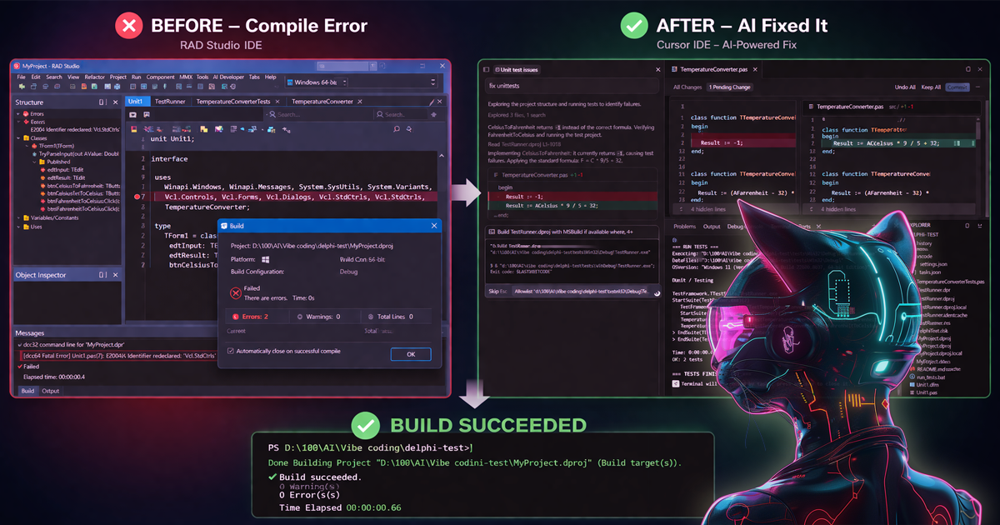
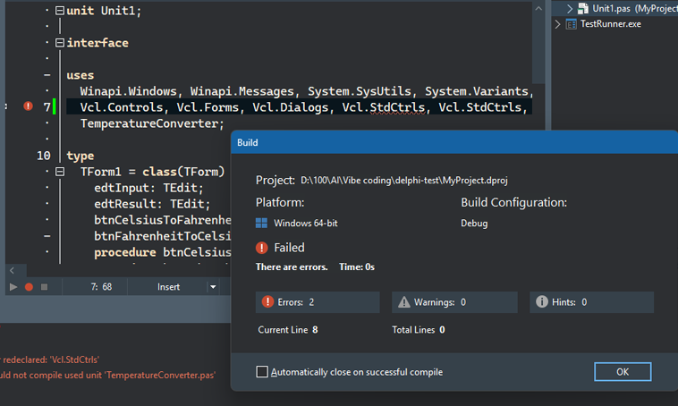
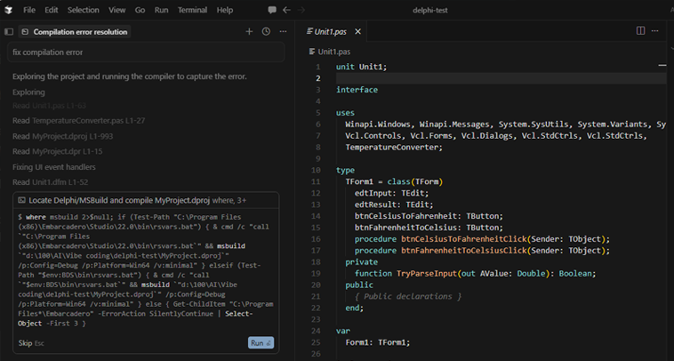
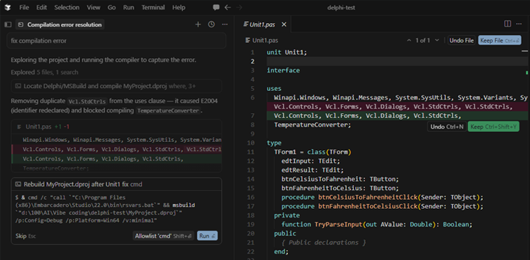
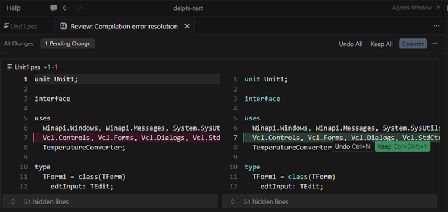
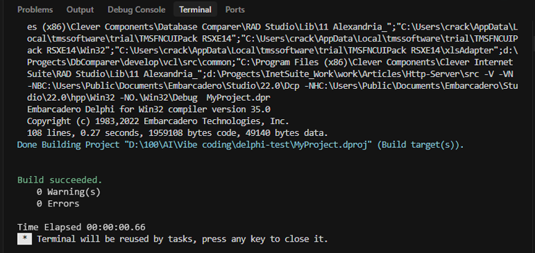
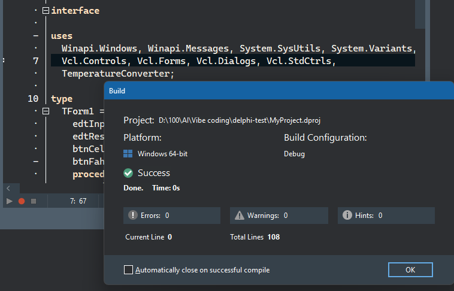
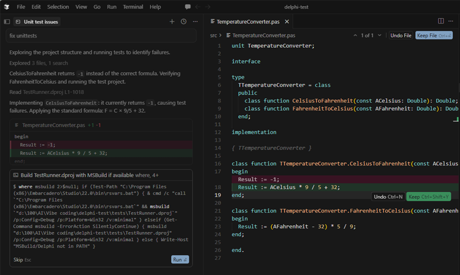
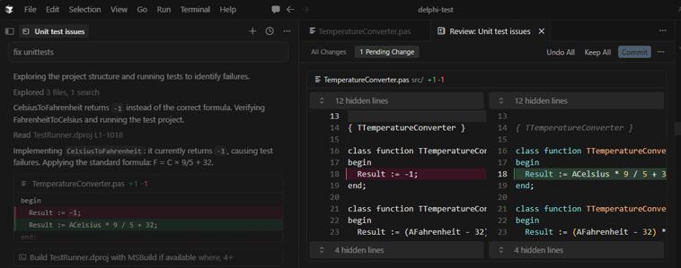
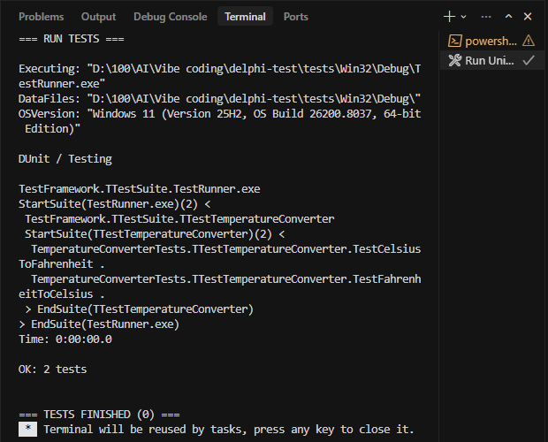

# 🚀 Delphi + AI Starter (Cursor + RAD Studio)



Build modern Delphi applications using AI (Cursor) + RAD Studio.

👉 Write code with AI  
👉 Compile and debug in Delphi  
👉 Safely evolve legacy codebases  
👉 **AI can fix compiler and test errors automatically via build/test feedback loop**  
👉 **Works with ANY Delphi version (no vendor lock-in)**  

---

## ⚡ What you get

* ✅ Preconfigured Cursor environment
* ✅ Working Delphi VCL project
* ✅ Unit test pipeline
* ✅ AI-driven workflow
* ✅ Safe approach for legacy systems

---

## 🧠 Why this matters

Delphi lacks modern AI tooling.

This project shows how to:

* use AI effectively without LSP
* work safely with large codebases
* build a repeatable development workflow

👉 Result: you can work with Delphi almost like a modern AI-first language.

---

# 🔧 Setup

## 1. Install required tools

* Cursor
* Delphi / RAD Studio
* Git

---

## 2. Install Cursor Extensions

Open:

```text id="ext2"
Extensions
```

### Required

* Pascal (alefragnani)

### Recommended

* Numbered Bookmarks

### Do NOT install

* DelphiLSP
* Delphi Keymap
* Any Delphi LSP extensions

---

## 3. Open project

```bash id="gclp8z"
git clone https://github.com/CleverComponents/<repo-name>.git
cd <repo-name>
```

---

# 📁 Project Structure

```text id="projstr2"
/src
/tests

run_tests.bat
.cursorrules

.vscode
  ├ settings.json
  └ tasks.json
```

---

# ⚙️ Configuration

This repository includes:

* `.vscode/settings.json` — file associations & encoding
* `.vscode/tasks.json` — build + test automation
* `run_tests.bat` — test pipeline
* `.cursorrules` — AI behavior rules

---

## 🧠 AI Rules

The `.cursorrules` file defines:

* keep code compilable
* avoid breaking API
* minimal changes
* use compiler output as truth

👉 See full file: `.cursorrules`

---

# 🧪 Build & Test Tasks

The project defines 3 tasks:

* **Build Win32**
* **Build Win64**
* **Run Unit Tests (default)**

👉 The test task:

* builds test runner
* runs tests
* returns exit code

---

## 🔁 Important: test task = build + run

Cursor executes:

1. msbuild
2. run_tests.bat
3. TestRunner.exe

👉 This enables AI to:

* read compiler errors
* detect test failures
* fix issues automatically

---

## ▶️ Running tasks

### Default build

```text id="bld1"
Ctrl + Shift + B
```

Runs **Run Unit Tests**

---

### Run specific task

```text id="bld2"
Ctrl + Shift + P → Tasks: Run Task
```

---

## ⚠️ Hotkey conflicts

If **Ctrl+Shift+B** does something else:

1. Open keyboard shortcuts
2. Search: `Run Build Task`
3. Reassign or remove conflicts

---

# 🔖 Navigation with Bookmarks

Set bookmark:

```text id="bm4"
Ctrl + Shift + [0-9]
```

Go to bookmark:

```text id="bm5"
Ctrl + [0-9]
```

Toggle:

```text id="bm6"
Ctrl + Shift + [0-9]
```

---

# 🔁 Example 1: Fix Compilation Error

## 1. Compile error in RAD Studio



---

## 2. AI analyzes the issue and asks for permission to compile the code



---

## 3. AI suggests a fix and then tests it



---

## 4. Review changes



---

## 5. Build inside Cursor



---

## 6. Verify in RAD Studio



---

# 🧪 Example 2: Fix Failing Unit Tests

## 1. Tests are failing



---

## 2. AI fixes the issue



---

## 3. Tests passed



---

# 🔁 Development Workflow

```text id="flow3"
1. Edit code
2. Ctrl+Shift+B → Run tests
3. Fix errors
4. Copy output
5. Paste into AI
6. Apply fix
7. Repeat
```

---

# ⚙️ Complex logic (LOW-LEVEL)

## ❌ Avoid

* global refactoring
* mass edits

---

## ✅ Prefer

* small targeted fixes
* incremental validation

---

## 🧠 Key rule

👉 Compiler is the source of truth

---

# 🤖 How to work with AI

Always provide:

* unit name
* relevant code
* compiler output

---

## Best practices

* small steps
* frequent builds
* test after every change

---

# 🔧 Compatibility (Delphi Versions)

👉 **The approach itself is NOT tied to any specific Delphi version**

You can use it with:

* latest Delphi versions
* older versions
* legacy / unsupported environments

---

## 🧪 Current project version

This project was created and tested with:

👉 **Delphi 11**

---

## ⬆️ Upgrade to newer Delphi

1. Open project in Delphi IDE
2. Accept project upgrade
3. Rebuild project

Additionally:

* update hardcoded Delphi paths in:

  * `.vscode/tasks.json`
  * `run_tests.bat`

---

## ⬇️ Downgrade to older Delphi

1. Delete `.dproj` file
2. Open `.dpr` in Delphi
3. IDE will recreate project file

Additionally:

* update Delphi paths
* adjust project settings if needed

---

## 🧱 Very old Delphi versions

If using legacy Delphi (pre-namespaces):

👉 you may need to:

* remove namespaces from `uses` clauses

Example:

```pascal id="nsfix"
System.SysUtils → SysUtils
```

---

# 🎯 Key Idea

Cursor = AI + orchestration
Delphi = compiler + runtime

---

## 🔗 Related

This AI-driven workflow is also used in:

- Clever Internet Suite tutorials  
- OpenAI integrations  
- WhatsApp automation  
- and more...

---

# 🏁 Summary

* Stable AI-assisted workflow
* Works with ANY Delphi version
* No LSP required
* Real-world ready

👉 This is how you bring **AI into Delphi today**
